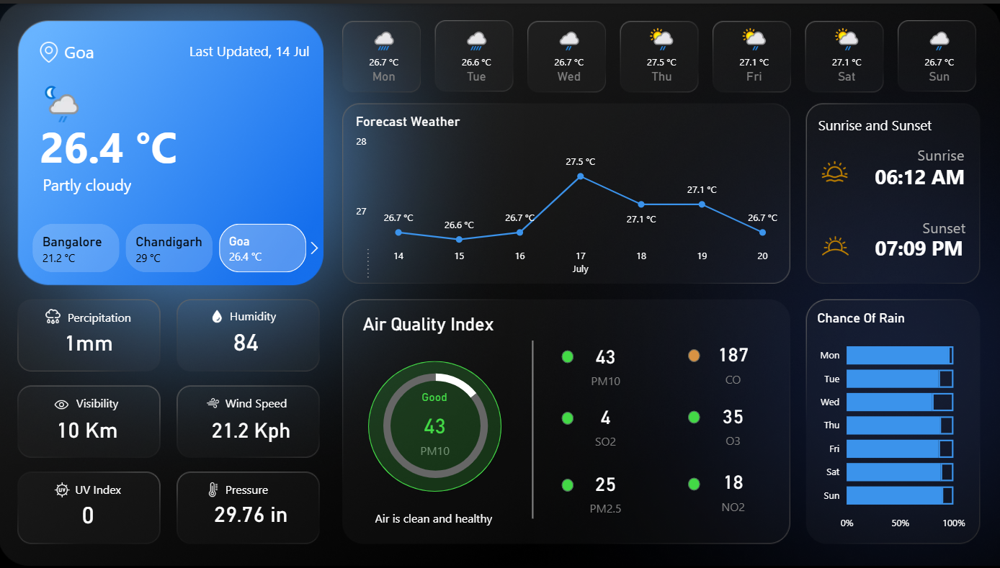

# Weather-Dashboard

# 🌦️ Weather Dashboard – Power BI Project

This project showcases an interactive **Weather Dashboard** built using **Power BI**, leveraging real-time data from the **OpenWeatherMap API**. The dashboard is designed to present city-wise weather insights in a clean and informative layout.

---

## 📌 Project Overview

The **Weather Dashboard** tracks real-time weather conditions across multiple cities. Users can filter data based on city or weather condition and view KPIs like temperature, humidity, wind speed, and more.

---

## 🔍 Key Features

- 🌡️ **Current Temperature, Min & Max Temperature**
- 💧 **Humidity & Wind Speed KPIs**
- 📈 **Time-Series Graphs** for daily trends
- 🗂️ **Interactive Filters** for city selection
- 📊 **Visually rich charts** and dynamic elements

---

## 🛠️ Tools & Technologies

- **Power BI Desktop**
- **OpenWeatherMap API** (for real-time weather data)
- **Power Query & DAX** for data manipulation and calculations

---

## 🖼️ Dashboard Preview

---

## 📁 Files Included

- `WeatherDashboard.pbix` – Power BI project file  
- `Dashboard-Screenshot.png` – Dashboard visual  
- `README.md` – Project documentation

---

## 🧠 What I Learned

- Working with APIs inside Power BI
- Data transformation using Power Query
- Creating dynamic visuals and custom KPIs using DAX
- Designing clean and interactive dashboards for end users

---

## 🔗 Project Link

View the full project:  
**[https://app.powerbi.com/view]([https://github.com/your-username/weather-dashboard](https://app.powerbi.com/view?r=eyJrIjoiMDVjMzViMDQtZmMxYi00NjJhLTkxNTEtYTViYTBhODRhMTJiIiwidCI6ImI1OGFjNjEwLTFhNzEtNDE4MC1iNjJkLTQxMTYwZTM4MDdiZSIsImMiOjN9))**

---

